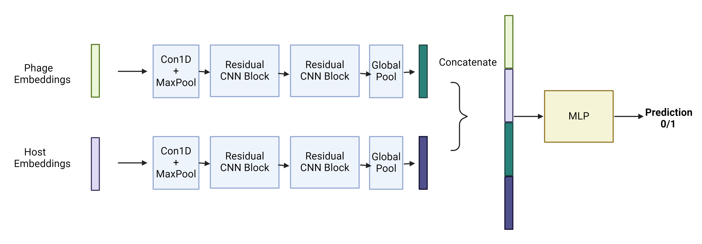

# CNN-based Prediction Head

## 1. Overview

Embeddings generated from Evo created from Evo has input shape (Batch, Length, Dim) fo each phage and bacteria. The length dimension is padded/truncated to the max length equal to length of 90th quantile of all sequences within each class (phage, bacteria).

The padded inputs for each lass are passed through convolution layer with max pooling then to 2 Block of Residual Convolution before glocal pooling. The ouputs are catted along with inital embeddings. The catted vector is passed through MLP layer and sigmoid function to get the final prediction. 



### Usage

```
python '/home/ec2-user/hackathonBio/khoa/phagebook_train.py' 
--dataset vibrio 
--viral_diff False 
--model_save_out /home/ec2-user/hackathonBio/khoa/outputs/vibrio/vibrio_viral_diff.pth 
--log_out /home/ec2-user/hackathonBio/khoa/outputs/vibrio/vibrio_viral_diff.log 
--cuda 0
```

- Dataset: dataset containing positive pairs
- viral_diff: if True, use MLP instead of CNN for phage embeddings processing
- model_save_out: output model with lowest validation loss
--log_out: stdout
--cuda: cuda device
