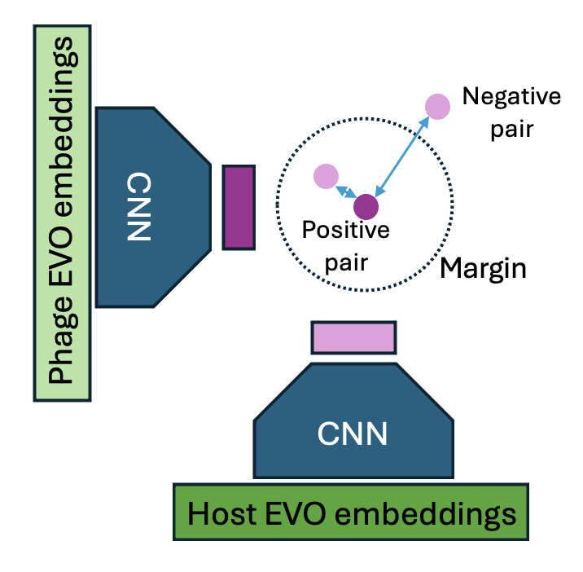

# Contrastive Learning

## 1. Model Architecture

The contrastive learning model consists of a CNN encoder and a contrastive loss. The input to the encoder is the phage and host EVO embeddings. Each EVO embedding corresponding to single sequence has the shape Nx4096 where N corresponds to the number of bins used to create the EVO embedding for a given sequence. The input to the CNN encoder is the normalzed sum across these bins.

The contrastive loss is trained using a set of positive phage-host pairs. All potential phage-host pairs not represented in the postive set are considered negative examples. For each phage-host pair, the contrastive loss computes the distance between the encoded pahge and encoded host. The loss attempts to minimize the distance between positive pairs and ensure that negatie pairs are farther than a given margin away.

<div style="text-align: center;">
    
</div>

### Usage

```python3 train.py 
--embedding_dir /mnt/efs/fs1/data/embeddings/vibrio_embeddings/
--metadata_dir /mnt/efs/fs1/data/metadata/vibrio/
--normalization_method sum
--batch_size 256
--margin 1
--learning_rate 0.001
--output_file model.pth
--device 0
```


