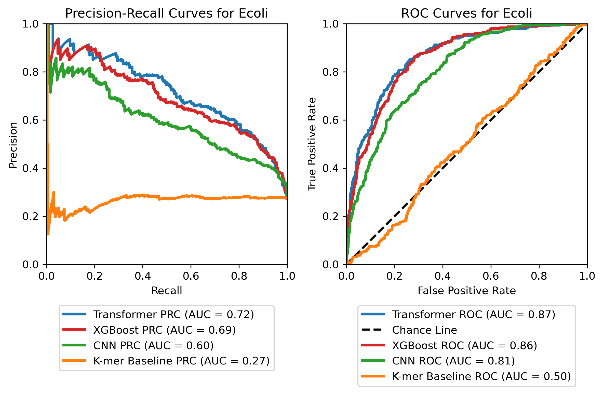
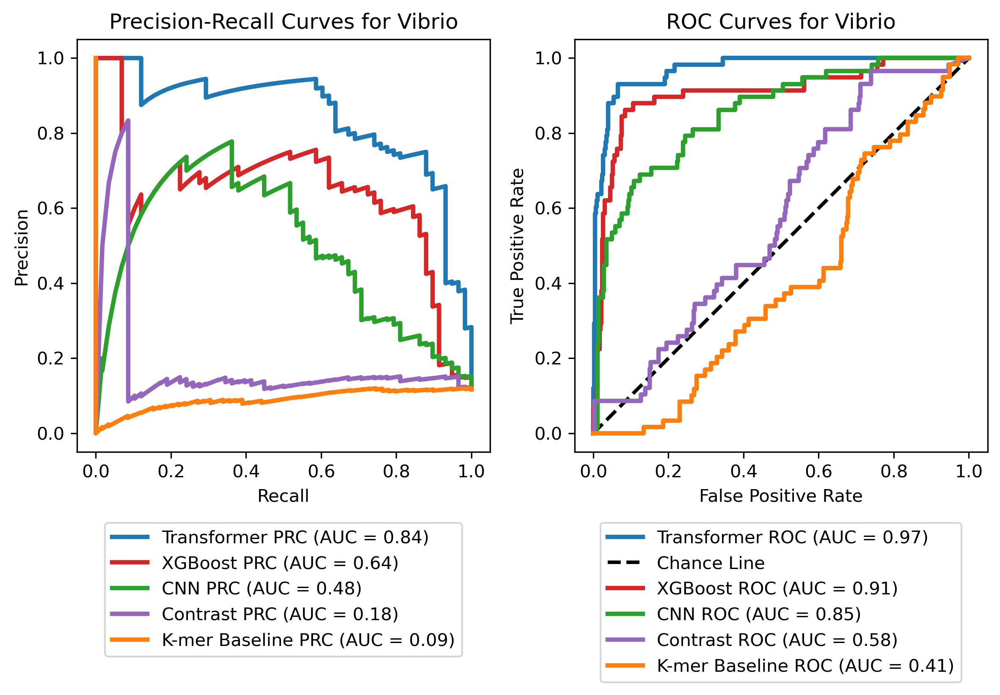
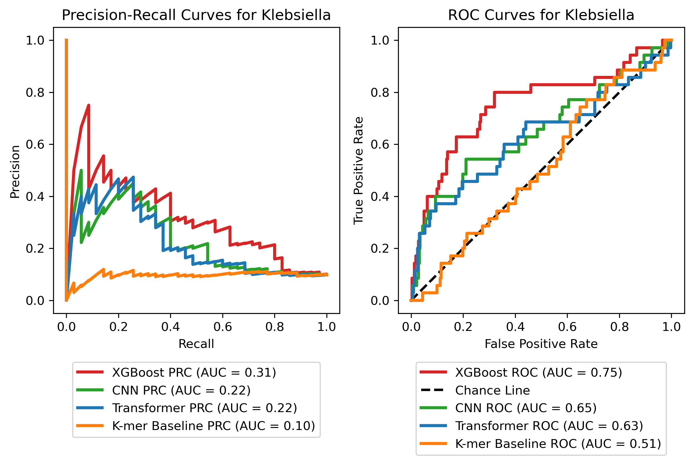

# PhageBook - [Bio X ML Hackathon Project](https://hackathon.bio/)

**Team Name:** PhageBook

**Project Duration:** 10 days

**Goal:** Utilizing Evo to predict phage-bacteria host interactions for antibiotic design.

# Table of Contents
1. [Background & Relevance](#1-background--relevance)
2. [Methodology](#2-methodology)
    * [Data Collection and Processing](#21-data-collection-and-processing)
    * [Feature Extraction](#22-feature-extraction)
    * [Modeling](#23-modeling)
3. [Results and Evaluation](#3-results-and-evaluation)
    * [Model Performance](#31-model-performance)
    * [Demo](#32-demo)
4. [Interpretation](#4-interpretation)
    * [Conclusions](#41-conclusions)
    * [Challenges Faced](#42-challenges-faced)
    * [Future Work](#43-future-work---evo-and-esm3-models)
5. [Potential impact](#5-potential-impact)
6. [Team Members](#6-team-members)

# Abstract
**PhageBook** is an innovative platform developed during a **10-day** [Bio X ML Hackathon Project](https://hackathon.bio/) to address the urgent challenge of antibiotic-resistant bacteria. By leveraging evolutionary models and cutting-edge machine learning techniques, **PhageBook accurately predicts phage-bacteria host interactions**, a crucial step toward designing effective phage therapies. Our models, trained on newly available experimental datasets, achieved impressive results, **with AUC values as high as 0.97**, demonstrating their potential to streamline phage therapy development.

As part of this project, we provide a live tool [demo](https://0bca511e83b482da4f.gradio.live/), where users can query bacterial strains against a set of phages and identify potential matches. Future versions of the tool will allow users to input clinical bacterial isolate sequences for real-time phage predictions. PhageBook is open-source, and with further optimization, it has the potential to revolutionize the way phage therapies are developed.

# 1. Background & Relevance
The rise of antibiotic-resistance bacteria is a global health crisis, with the CDC identifying antimicrobial resistance as a major thread [1](https://www.cdc.gov/antimicrobial-resistance/data-research/threats/index.html). As antibiotics lose effectiveness, the need for new therapies has become urgent. Phage therapy, which uses bacteriophages to target and kill bacteria, offers a promising alternative [2](https://pmc.ncbi.nlm.nih.gov/articles/PMC5547374/). However, scaling phage therapy is hindered by the time-consuming and expensive process of matching the right phage to each bacterial strain, requiring extensive lab testing and specialized facilities [3](https://pmc.ncbi.nlm.nih.gov/articles/PMC10747886/). 

Computational tools have begin to streamline this process by predicting phage-host interactions using genome data. **PhageBook** advances this efforts by leveraging experimentally validated datasets and state-of-the-art machine learning models like **EVO**  and **transformers** [4](https://arcinstitute.org/news/blog/evo) [5](https://proceedings.neurips.cc/paper_files/paper/2017/file/3f5ee243547dee91fbd053c1c4a845aa-Paper.pdf) to accurately predict phage-bacteria ineractions. This approach significantly reduces the time and cost of developing phage therapies, enabling faster clinical application. The **EVO** model, developed by the **Arc Institute**, is specifically trained on massive datasets that include both bacterial and phage seqeunces. EVO is a feep evolutionary model designed to extract sequences embeddings from wide array of genomes. 

Unlike traditional methods which requires labor-intensive genome annotation to identify potential phage-host matches, **PhageBook** uses readily available genome-wide data. This not only simplifies the process but achives accuracy comparable to expert-driven methods, providing an efficient and accessible solution to fighting antibiotic resistance. 

# 2. Methodology

### 2.1 Data Collection and Processing
We used several publicly available datasets for phage-host pairs. Key steps in data collection and processing include: 
**Phage and Bacterial Data**: We collected four experimentally validated datasets (_PhagesDB_, _Klebsiella_, _Vibrio_, and _E. coli_) and one with predicted pairs (PhageScope). Brief summary of data curation procedure:

* For experimental studies of individual species, their in vitro verified interactions were collected from the supplementary tables of the manuscripts ([E. coli](https://doi.org/10.1101/2023.11.22.567924), [Vibrio](https://doi.org/10.1038/s41467-021-27583-z), and [Klebsiella](https://doi.org/10.1038/s41467-024-48675-6)). Phage genome sequence data and bacterial genome sequence data were retrieved from RefSeq and Genbank according to the unique IDs provided by the study authors. In the end, for these datasets, we have pairs between:
     * **E.coli: 325 bacterial hosts and 96 phages**
     * **Vibrio: 259 bacterial hosts and 239 phages**
     * **Klebsiella: 149 bacterial hosts and 115 phages**

* For PhagesDB, we retrieved phage-host pairs and phage genome sequences from their [web platform](https://phagesdb.org/) and separately retrieved bacterial genome sequences from RefSeq using a taxonomy search. Ultimately, we have interactions between **4766 unique phages and 74 bacterial hosts.**
* For PhageScope, we retrieved phage-host pairs and phage genome sequences from their [web platform](https://phagescope.deepomics.org/database). We filtered phages to the subset of these with complete genome sequences and lylic lifestyle. The bacterial host data specified only the host taxonomy name, so we filtered the data to include only hosts with full species-level taxonomy known (the most specific level of host information available in this database). We also separately retrieved bacterial genome sequences from RefSeq using a taxonomy search and picked the genome sequence of the best quality if multiple genomes were available. Ultimately, we have interactions between **4434 unique phages and 180 bacterial host species.** 

The curated datasets we used to train the models can be found [here](https://doi.org/10.5281/zenodo.13956128).
For every dataset we are prividing a metadata file that contains positive phage-host pairs (all other possible pairs are considered negative) and two subfolders with fasta files containing genome sequences for every phage and bacteria in the dataset.

### 2.2 Feature Extraction
We use EVO (togethercomputer/evo-1-131k-base) to extract embedding features for host and phage genome sequences. Since each genome can have up to millions of tokens, which is beyond EVO's training sequence length and computationally infeasible, we chunk each sequence into non-overlapping subsequences of length 40,000. We then input each subsequence to EVO and extract the output of the penultimate layer, resulting in a feature matrix of shape (N, 4096) for each genome, where N can vary between different genome sequences. The code and details of this procedure can be found [here](https://github.com/havu73/hackathonBio/tree/main/gen_embeddings).

### 2.3. Modeling
We tested several modeling strategies to predict phage-host interactions from the host and phage embeddings:
* [**K-mer baseline:**](https://github.com/havu73/hackathonBio/tree/main/PB-LKS_mod) We used PB-LKS as a baseline prediction model to compare against our team's model. It is developed by [Qui et al., 2024](https://pmc.ncbi.nlm.nih.gov/articles/PMC10859729/), and uses k-mer frequency counting as the basis for feature extraction. 
* [**XGBoost:**](https://github.com/havu73/hackathonBio/tree/main/Tree) We average pooled each genome embedding to a fixed-dimension vector of size 4096, concatenated each pair of bacteria and phage embeddings, and trained an XGBoost model to predict the pair label for the concatenation. We used a weighted loss function to address the class imbalance in the pair data.
* [**Contrast:**](https://github.com/havu73/hackathonBio/tree/main/Contrast) We first average pooled embeddings similarly to XGBoost. We then implemented a contrastive learning model that projects the phage and host embeddings into a common embedding space and applies a contrastive loss function to minimize the distance between positive phage-host pairs while pushing negative pairs further apart. 
* [**CNN:**](https://github.com/havu73/hackathonBio/tree/main/CNN) On top of the embeddings, we explored convolutional layers to improve predictions based on sequence embeddings. We also experimented with the Fourier transform to optimize dimensionality. 
* [**Transformer Classifier:**](https://github.com/havu73/hackathonBio/tree/main/Transformer) We trained a transformer model to classify bacteria-phage interactions from the concatenated sequence of bacteria and phage embeddings. To account for the varying sequence length, we right-pad each sequence to a fixed length and use a mask to ignore these paddings in the attention layers.
  
**All of these models were trained using one V100-16GB GPU on a p3.16xlarge on AWS EC2. We thank AWS for the great support!**


# 3. Results and Evaluation

### 3.1 Model Performance

For each dataset (e.g., _Klebsiella_, _Vibrio_, and _E. coli_), our predictions were evaluated against a common set of ground truth datasets, which contained the columns Phage_ID, Host_ID, and prediction to denote positive and negative pairs. 
For the evaluation of our models, we used standard metrics for binary classification tasks, focusing on Precision-Recall Curves (PRC) and Receiver Operating Characteristic (ROC) Curves. The PRC AUC (Area Under the Curve) provided a summary of the precision-recall tradeoff, particularly useful in our unbalanced datasets, with higher values indicating better performance. ROC AUC measured how well the model distinguished between positive and negative classes, with the Chance Line included as a baseline for comparison. We evaluated several models, including K-mer Baseline, XGBoost, CNN, Contrastive Learning, and Transformer, ranking them based on PRC AUC, which was prioritized due to the class imbalance in our data.

Below are the Precision-Recall and ROC curves for each dataset tested. For the _Vibrio_ and _E. coli_ datasets, the Transformer Classifier achieved the highest performance with AUC of 0.97 and 0.87, respectively, followed by KGBoost and CNN. XGBoost achieved the highest AUC of 0.75 for the _Klebsiella_ dataset. We use Precision-Recall as a main metric to pick the best model, because it is less sensitive to the labels imbalance that is a common feature of all our datasets.

### E.coli models


### Vibrio models


### Klebsiella models


### 3.2 Demo

We also provide a [demo](https://0bca511e83b482da4f.gradio.live/) that allows to query bacterial strains in our current collection against a set of phages. It allows users to pick the phage that will be able to kill given bacteria. In the future we plan to extend its functionality by enabling the users to provide the sequence of their clinical isolate and we will provide a set of predicted known phages that might be able to target this bacteria.

# 4. Interpretation

### 4.1 Conclusions

PhageBook successfully demonstrated the potential of using evolutionary models to predict phage-bacteria host interactions within a universal framework. We want to note that two of the datasets we used in our project ([Klebsiella](https://doi.org/10.1038/s41467-024-48675-6) and [E. coli](https://doi.org/10.1101/2023.11.22.567924)) had an accompanying study which tried to make a predictive model based on the detailed expert domain knowledge. Their approach entailed tedious annotation of genome sequences to finish and characterize genes potentially involved in the phage-host interaction. In contrast, our naive approach that requires only knowledge of the full genome sequence (which is much easier to obtain given the present-day cost of sequencing) reached the same accuracy level, bypassing the need for any additional data curation. We have also collected two datasets from curated databases of phage-host interactions hoping to test generalizability of our approach across many different bacterial and phage types. However, we realized that these database do not provide an easy way to retrieve both phage and bacterial host genomes. We made our best attempt to fix this issue, but the model training on these data was not successful.

### 4.2 Challenges Faced
One major challenge was handling the computational load when running Evo model on large datasets. We resolved this by leveraging AWS instances with NVIDIA A30 GPUs, setting chunk-size to 5K in feature extraction of phages’ genome, managing memory efficiently, and running parallel jobs. Another challenge was ensuring data consistency across diverse bacterial species, which we addressed by implementing rigorous data validation steps.

* __Challenges of the data collection:__ Some datasets had missing data for phage-bacterial pairs and included phages or bacterial hosts that were not matched to their counterparts (the learning task for these is trivial). In addition, we discovered that not all genome sequences were made publicly available by the authors, so we had to carefully curate these datasets. 

* __Challenges of embedding engineering:__ Initially, it was unclear how to best combine phage and host embeddings. Due to the resource intensity of generating Evo embeddings, we opted for post-hoc embedding engineering. Visualizations revealed that while concatenation and padding were effective, alternative methods like embedding summation captured additional sequence-length information, yielding better results. Ultimately, we employed different strategies across various model trainings.

* __Challenges of Transformer:__

* __Challenges of XGBoost:__ A key challenge with tree-based models is converting unstructured embeddings into structured tabular data, as discussed in the embedding engineering section. Additionally, the time complexity of thorough hyperparameter searches posed difficulties. To address this, we switched to LightGBM for more efficient training, while maintaining the name "XGBoost" for consistency.

* __Challenges of CNN model:__ Challenges with the CNN model include padding inputs to maintain similar input dimensions. This increases memory requirement and better engineering for data loaders. In addition, for short sequences of bacteria and phages, the padded tokens introduce substantial artifacts in the input and potentially weaken the signals.
In the current training under this model, negative pair examples were chosen to be twice the number of positive pairs and fixed during training. In the future, a random sampling of negative pairs could be more desirable as the model is exposed to more negative pairs while maintaining a good positive/negative label ratio.

* __Challenges of the contrastive learning model:__ One challenge was the computational cost of loading and computing the embeddings for each phage-host pair, which we resolved by writing a data loader to only compute the embeddings for unique phages and hosts and then subsequently compute the loss across all pairs. Additionally, the primary challenge with the contrastive learning model was determining an effective method to transform the original phage and host EVO embeddings into the common embedding space. The contrastive learning model suffered from collapsed embeddings, particular for the phage samples, resulting in a lack of distinction between positive and negative phage-host pairs. This issue may be partially caused by the preprocessing steps to account for the variable size of host and bacteria EVO embeddings diluting the signal between positive and negative pairs. Using an encoding method that can handle variable input dimensions could ameliorate this issue. Additionally, while contrastive learning benefits from a large class imbalance, the number of positive pairs in our input data could contribute to the issue. Performing data augmentation on the positive pairs is a common strategy in contrastive learning and has the potential to both increase model robustness and help learn a meaningful embedding space for the contrastive model, without sacrificing the number of negative samples and necessary class imbalance.

### 4.3 Future Work - EVO and ESM3 models

Our future work will focus on expanding the dataset to include more diverse bacterial species, optimizing the models for faster processing, and fine-tuning the Evo model to increase its predictive power. Additionally, we aim to expand on our user-friendly interface for broader accessibility.

Building on the success of extracting whole-genome sequence from phage-host pairs, the next step is to incorporate protein sequence data embeddings. Using the advanced [**ESM3**](https://www.evolutionaryscale.ai/blog/esm3-release) model, a large-scale protein langugage model trained on a vast dataset of protein sequences, will allow us to capture intricate structural and functional information at both residue and sequence levels.

Integrating protein sequences from phage-host pairs with ESM3 will allow us to explore phage-host interactions at a mode granular level, particularly by analysing protein-protein interactions that may drive host specificity and viral infectivity. This will provide deeper insights unto how phages target specific bacteria proteins, potentially revealing new therapeutic targets. 

By combining both whole-genome and portein sequence data, we will gain more comprehensive understading of phage-host dynamics. This dual approach will enhance the accuracy of our predictions and expand the versatility of **PhageBook**, allowing it to predict interactions across various biological levels, from genomic signals to proteins mechanisms. This could open the door to more precise phage therapy, tailored not just to the bacterial species but to specific protein targets, pushing the boundaries of personalize medicine in the treatment of resistant infections. 


# 5. Potential impact

**PhageBook** has the potential to revolutionize the treatment of antibiotic-resistant infections by significantly accelerating the process of identifying effective phage-host pairs. Traditional phage therapy methods are slow and costly, relying on manual lab work to match potential phages to bacterial strains. **PhageBook** overcomes this by using advanced machine learning models that perdict interactions based on genome-wide data, reducing time and costs while maintaining high accuracy, with AUC values up to 0.97. 

The scalability of **PhageBook** makes it suitable for both large-scale applications and personalized medicine, where it can be adapted to target specific bacterial strains in clinical settings. By enabling rapid phage therapy develpments, **PhageBook** can help combat the growing thread of multidrug-resistant bacteria, potentially saving countless lives and extending the efficacy of existing treatments. As antibiotics become less effective, **PhageBook** offers a vital tool to ensure we stay ahead in the battle againsts superbugs. 

# 6. Team Members

<div style="display: flex; align-items: center; border: 1px solid black; padding: 10px;">
  
  <div>
    <a href="https://www.linkedin.com/in/ha-vu-profile/" target="_blank"><strong>Ha Vu:</strong></a> Postdoctoral Scholar, Gladstone Institutes<br>
    <strong>Role: Team Lead,</strong> pipeline construction, feature extraction<br>
    
  </div>
</div>

<div style="display: flex; align-items: center; border: 1px solid black; padding: 10px; max-width: 200px;">
  
  <div>
    <a href="https://www.linkedin.com/in/veronika-dubinkina/" target="_blank"><strong>Veronika Dubinkina:</strong></a> Postdoctoral Scholar, Gladstone Institutes<br>
    <strong>Role:</strong> Data curation and domain knowledge<br>
    
  </div>
</div>

<div style="display: flex; align-items: center; border: 1px solid black; padding: 10px; max-width: 200px;">
  
  <div>
    <a href="https://www.linkedin.com/in/boyang-fu/" target="_blank"><strong>Boyang Fu:</strong></a> PhD Student, UCLA<br>
    <strong>Role:</strong> Embedding engineering, model training<br>
    
  </div>
</div>

<div style="display: flex; align-items: center; border: 1px solid black; padding: 10px; max-width: 200px;">
  
  <div>
    <a href="https://www.linkedin.com/in/emilymaciejewski/" target="_blank"><strong>Emily Maciejewski:</strong></a> PhD Student, UCLA<br>
    <strong>Role:</strong> Model training<br>
    
  </div>
</div>

<div style="display: flex; align-items: center; border: 1px solid black; padding: 10px; max-width: 200px;">
  
  <div>
    <a href="https://www.linkedin.com/in/khoa-hoang-babb30172/" target="_blank"><strong>Khoa Hoang:</strong></a> PhD Student, Stanford<br>
    <strong>Role:</strong> Model training<br>
    
  </div>
</div>

<div style="display: flex; align-items: center; border: 1px solid black; padding: 10px; max-width: 200px;">
  
  <div>
    <a href="https://www.linkedin.com/in/tung-nguyen-40703616b/" target="_blank"><strong>Tung Nguyen:</strong></a> PhD Student, UCLA/Google DeepMind<br>
    <strong>Role:</strong> Infrastructure setup, feature extraction, model training<br>
    
  </div>
</div>

<div style="display: flex; align-items: center; border: 1px solid black; padding: 10px; max-width: 200px;">
  
  <div>
    <a href="https://www.linkedin.com/in/cindykhris/" target="_blank"><strong>Cindy K. Pino:</strong></a> PhD Student, UCSF/UCB/Gladstone Institutes<br>
    <strong>Role:</strong> Data curation, domain knowledge, model evaluator<br>
    
  </div> 
</div>
  
 ## Cite

When using one of the models implemented in this repo in academic work please cite:
```
@misc{phagebook2024,
  title        = {Phagebook - Bio X ML Hackathon Project},
  author       = {Vu, Ha, Dubinkina, Veronika, Fu, Boyang, Maciejewski, Emily, Hoang, Khoa, Nguyen, Tung, Pino, Cindy},
  month        = {October},
  year         = {2024},
  howpublished = {\url{https://github.com/havu73/hackathonBio}}
}
```