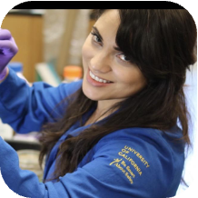

# PhageBook - BioML Hackathon Project

**Team Name:** PhageBook

**Project Duration:** 10 days

**Goal:** Utilizing Evo to predict phage-bacteria host interactions for antibiotic design.

# Table of Contents
1. Background & Relevance
2. Methodology
    * Data Collection and Processing
    * Modeling and Prediction
3. Results and Evaluation
    * Model performance
    * Demo
4. Interpretation
    * Challenges Faced
    * Conclusion
    *  Future Work
5. Potential impact
6. Team Members

# Abstract
PhageBook is an innovative platform developed during a 10-day hackathon to address the urgent challenge of antibiotic-resistant bacteria. By leveraging evolutionary models and cutting-edge machine learning techniques, PhageBook accurately predicts phage-bacteria host interactions, a crucial step toward designing effective phage therapies. Our models, trained on newly available experimental datasets, achieved impressive results, with AUC values as high as 0.97, demonstrating their potential to streamline phage therapy development.

As part of this project, we provide a live tool [demo](https://6b0fbc27cf15dd75ec.gradio.live/), where users can query bacterial strains against a set of phages and identify potential matches. Future versions of the tool will allow users to input clinical bacterial isolate sequences for real-time phage predictions. PhageBook is open-source, and with further optimization, it has the potential to revolutionize the way phage therapies are developed.

# 1. Background & Relevance
The increasing prevalence of antibiotic-resistant bacteria is a global health concern. Current antibiotics are becoming less effective, and there is an urgent need for novel therapeutic solutions. Phage therapy offers a promising alternative by using viruses that specifically target and kill bacteria. However, identifying the right phage for a given bacterial strain remains challenging. **PhageBook** aims to address this by leveraging the recently collected experimental data and state-of-the-art machine learning approaches to accurately predict phage-bacteria host interactions.

# 2. Methodology

### 2.1 Data Collection and Processing
We used several publicly available datasets for phage-host pairs. Key steps in data collection and processing include: 
Phage and Bacterial Data: We collected four experimentally validated datasets (PhagesDB, Klebsiella, Vibrio, and E. coli) and one with predicted pairs (PhageScope). Brief summary of data curation procedure:

* For experimental studies of individual species, their in vitro verified interactions were collected from the supplementary tables of the manuscripts ([E. coli](https://doi.org/10.1101/2023.11.22.567924), [Vibrio](https://doi.org/10.1038/s41467-021-27583-z), and [Klebsiella](https://doi.org/10.1038/s41467-024-48675-6)). Phage genome sequence data and bacterial genome sequence data were retrieved from RefSeq and Genbank according to the unique IDs provided by the study authors. In the end, for these datasets, we have pairs between:

    * **Vibrio: 259 bacterial hosts and 239 phages**

    * **Klebsiella: 149 bacterial hosts and 115 phages**

    * **E.coli: 325 bacterial hosts and 96 phages**

* For PhagesDB, we retrieved phage-host pairs and phage genome sequences from their [web platform](https://phagesdb.org/) and separately retrieved bacterial genome sequences from RefSeq using a taxonomy search. Ultimately, we have interactions between **4766 unique phages and 74 bacterial hosts.**
* For PhageScope, we retrieved phage-host pairs and phage genome sequences from their [web platform](https://phagescope.deepomics.org/database). We filtered phages to the subset of these with complete genome sequences and lylic lifestyle. The bacterial host data specified only the host taxonomy name, so we filtered the data to include only hosts with full species-level taxonomy known (the most specific level of host information available in this database). We also separately retrieved bacterial genome sequences from RefSeq using a taxonomy search and picked the genome sequence of the best quality if multiple genomes were available. Ultimately, we have interactions between **4434 unique phages and 180 bacterial host species.** 

The curated datasets we used to train the models can be found [here](link).
For every dataset we are prividing a metadata file that contains positive phage-host pairs (all other possible pairs are considered negative) and two subfolders with fasta files containing genome sequences for every phage and bacteria in the dataset.

### 2.2 Feature Extraction
We use EVO (togethercomputer/evo-1-131k-base) to extract embedding features for host and phage genome sequences. Since each genome can have up to millions of tokens, which is beyond EVO's training sequence length and computationally infeasible, we chunk each sequence into non-overlapping subsequences of length 40,000. We then input each subsequence to EVO and extract the output of the penultimate layer, resulting in a feature matrix of shape (N, 4096) for each genome, where N can vary between different genome sequences. The code and details of this procedure can be found [here](https://github.com/havu73/hackathonBio/tree/main/gen_embeddings).

### 2.3. Modeling
We tested several modeling strategies to predict phage-host interactions from the host and phage embeddings:
* [**K-mer baseline:**](https://github.com/havu73/hackathonBio/blob/main/explorationHa/PB-LKS) We implemented a baseline prediction using Evo’s zero-shot capabilities, embedding phage-host pairs and calculating distances between embeddings for ranking predictions. 
* [**XGBoost:**](https://github.com/havu73/hackathonBio/tree/main/Tree) We average pooled each genome embedding to a fixed-dimension vector of size 4096, concatenated each pair of bacteria and phage embeddings, and trained an XGBoost model to predict the pair label for the concatenation. We used a weighted loss function to address the class imbalance in the pair data.
* [**Contrast:**](https://github.com/havu73/hackathonBio/tree/main/Contrast) We first average pooled embeddings similarly to XGBoost. We then implemented a contrastive learning model that projects the phage and host embeddings into a common embedding space and applies a contrastive loss function to minimize the distance between positive phage-host pairs while pushing negative pairs further apart. 
* [**CNN:**](https://github.com/havu73/hackathonBio/tree/main/CNN) On top of the embeddings, we explored convolutional layers to improve predictions based on sequence embeddings. We also experimented with the Fourier transform to optimize dimensionality. 
* [**Transformer Classifier:**](https://github.com/havu73/hackathonBio/tree/main/Transformer) We trained a transformer model to classify bacteria-phage interactions from the concatenated sequence of bacteria and phage embeddings. To account for the varying sequence length, we right-pad each sequence to a fixed length and use a mask to ignore these paddings in the attention layers.
All of these models were trained using one V100-16GB GPU on a p3.16xlarge on AWS EC2. We thank AWS for the great support!

# 3. Results and Evaluation

### 3.1 Model Performance

For each dataset (e.g., Klebsiella, Vibrio, and E. coli), our predictions were evaluated against a common set of ground truth datasets, which contained the columns Phage_ID, Host_ID, and prediction to denote positive and negative pairs. 
For the evaluation of our models, we used standard metrics for binary classification tasks, focusing on Precision-Recall Curves (PRC) and Receiver Operating Characteristic (ROC) Curves. The PRC AUC (Area Under the Curve) provided a summary of the precision-recall tradeoff, particularly useful in our unbalanced datasets, with higher values indicating better performance. ROC AUC measured how well the model distinguished between positive and negative classes, with the Chance Line included as a baseline for comparison. We evaluated several models, including XGBoost, CNN, K-mer Baseline, and Transformer, ranking them based on PRC AUC, which was prioritized due to the class imbalance in our data.

Below are the Precision-Recall and ROC curves for each dataset tested. For the Vibrio and E. coli datasets, the Transformer Classifier achieved the highest performance with AUC of 0.97 and 0.87, respectively, followed by KGBoost and CNN. XGBoost achieved the highest AUC of 0.75 for the Klebsiella dataset. We use Precision-Recall as a main metric to pick the best model, because it is less sensitive to the labels imbalance that is a common feature of all our datasets.

### E.coli models

### Vibrio models

### Klebsiella models

### 3.2 Demo

We also provide a [demo](https://6b0fbc27cf15dd75ec.gradio.live/) that allows to query bacterial strains in our current collection against a set of phages. It allows users to pick the phage that will be able to kill given bacteria. In the future we plan to extend its functionality by enabling the users to provide the sequence of their clinical isolate and we will provide a set of predicted known phages that might be able to target this bacteria.

# 4. Interpretation
### 4.1 Challenges Faced
One major challenge was handling the computational load when running Evo and ESM3 models on large datasets. We resolved this by leveraging AWS instances with NVIDIA A30 GPUs, setting chunk-size to 5K in feature extraction of phages’ genome, managing memory efficiently, and running parallel jobs. Another challenge was ensuring data consistency across diverse bacterial species, which we addressed by implementing rigorous data validation steps.

__Challenges of the data collection:__ Some datasets had missing data for phage-bacterial pairs and included phages or bacterial hosts that were not matched to their counterparts (the learning task for these is trivial). In addition, we discovered that not all genome sequences were made publicly available by the authors, so we had to carefully curate these datasets. 

__Challenges of Transformer:__

__Challenges of XGBoost:__

__Challenges of CNN model:__ Challenges with the CNN model include padding inputs to maintain similar input dimensions. This increases memory requirement and better engineering for data loaders. In addition, for short sequences of bacteria and phages, the padded tokens introduce substantial artifacts in the input and potentially weaken the signals.
In the current training under this model, negative pair examples were chosen to be twice the number of positive pairs and fixed during training. In the future, a random sampling of negative pairs could be more desirable as the model is exposed to more negative pairs while maintaining a good positive/negative label ratio.

__Challenges of the contrastive learning model:__ One challenge was the computational cost of loading and computing the embeddings for each phage-host pair, which we resolved by writing a data loader to only compute the embeddings for unique phages and hosts and then subsequently compute the loss across all pairs. Additionally, the primary challenge with the contrastive learning model was determining an effective method to transform the original phage and host EVO embeddings into the common embedding space. The contrastive learning model suffered from collapsed embeddings, particular for the phage samples, resulting in a lack of distinction between positive and negative phage-host pairs. This issue may be partially caused by the preprocessing steps to account for the variable size of host and bacteria EVO embeddings diluting the signal between positive and negative pairs. Using an encoding method that can handle variable input dimensions could ameliorate this issue. Additionally, while contrastive learning benefits from a large class imbalance, the number of positive pairs in our input data could contribute to the issue. Performing data augmentation on the positive pairs is a common strategy in contrastive learning and has the potential to both increase model robustness and help learn a meaningful embedding space for the contrastive model, without sacrificing the number of negative samples and necessary class imbalance.

### 4.2 Conclusions

PhageBook successfully demonstrated the potential of using evolutionary models to predict phage-bacteria host interactions within a universal framework. We want to note that two of the datasets we used in our project ([Klebsiella](https://doi.org/10.1038/s41467-024-48675-6) and [E. coli](https://doi.org/10.1101/2023.11.22.567924)) had an accompanying study which tried to make a predictive model based on the detailed expert domain knowledge. Their approach entailed tedious annotation of genome sequences to finish and characterize genes potentially involved in the phage-host interaction. However, our naive approach that requires only knowledge of the full genome sequence (which is much easier to obtain given the present-day cost of sequencing) reached the same accuracy level, bypassing the need for any additional data curation. 

### 4.3 Future Work

Our future work will focus on expanding the dataset to include more diverse bacterial species, optimizing the models for faster processing, and finetuning the Evo model to increase its predictive power. Additionally, we aim to develop a user-friendly interface for broader accessibility.

# 5. Potential impact

Our work provides a foundation for future research into phage therapy as a viable alternative to antibiotics, and the results indicate that integrating larger models like EVO and ESM3 can significantly simplify the process and potentially improve our ability to find a cure for many bacterial infections.

# 6. Team Members

  
  

    <strong>Ha Vu:</strong> Postdoctoral Scholar, Gladstone Institutes 
    <strong>Role: Team Lead,</strong> pipeline construction, feature extraction
  

  
  

    <strong>Veronika Dubinkina:</strong> Postdoctoral Scholar, Gladstone Institutes 
    <strong>Role:</strong> Data curation and domain knowledge
  

  
  

    <strong>Boyang Fu:</strong> PhD Student, UCLA 
    <strong>Role:</strong> Model training
  

  
  

    <strong>Emily Maciejewski:</strong> PhD Student, UCLA 
    <strong>Role:</strong> Model training
  

  
  

    <strong>Khoa Hoang:</strong> PhD Student, Stanford 
    <strong>Role:</strong> Model training
  

  
  

    <strong>Tung Nguyen:</strong> PhD Student, UCLA/Google DeepMind 
    <strong>Role:</strong> Infrastructure setup, feature extraction, model training
  

  
  

    <strong>Cindy K. Pino:</strong> PhD Student, UCSF/UCB/Gladstone Institutes 
    <strong>Role:</strong> Data curation and domain knowledge
  

  
