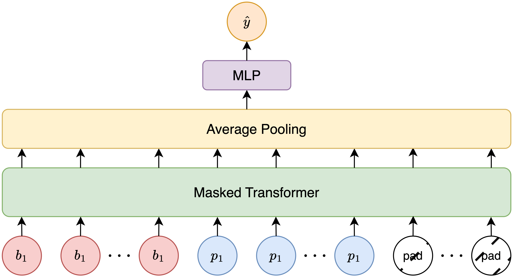

# Transformer Classifier

## Model architecture

The input sequence to the Transformer is a concatenation of the bacteria and phage embeddings. Since the sequence length varies between different pairs, we pad each sequence with all-zeros vectors to a fixed length. We feed this sequence to a stack of Transformer encoder blocks with a special mask to ignore the padding tokens in the attention layers. The output of the last block is average pooled and fed to a linear head to predict the label.

<!--  -->
<div style="text-align: center;">
    
</div>

## Data pipeline

The original dataset is a list of matching bacterias and phages, i.e., pairs that are known to have interactions. We first augment this dataset with non-interacting (negative) pairs by iterating over the combinations of bacterias and phages. 

Since the number of negative pairs dominates the number of positive pairs, random sampling from this imbalanced data will lead to a poor performing model. We therefore adopt an oversampling strategy for the positive pairs. That is, for each training iteration, we sample an equal number of positive and negative pairs to train the model. This strategy allows us to use all available negative pairs while stopping the model from always outputing 0 via oversampling.

# Usage

To train the model, run:

```
python train.py
--dataset <DATASET>
--root_dir <ROOT_DIR> 
--exp_name <NAME>
--wandb_project <WANDB_PROJECT>
```

- DATASET: name of the dataset. We currently support ["klebsiella", "vibrio", "ecoli", "vikecoli", "phageDB", "phageScope"].
- ROOT_DIR: root directory to save checkpoints and logs.
- NAME: name of the experiment. This will determine the experiment directory and wandb run name.
--WANDB_PROJECT: name of the wandb project.