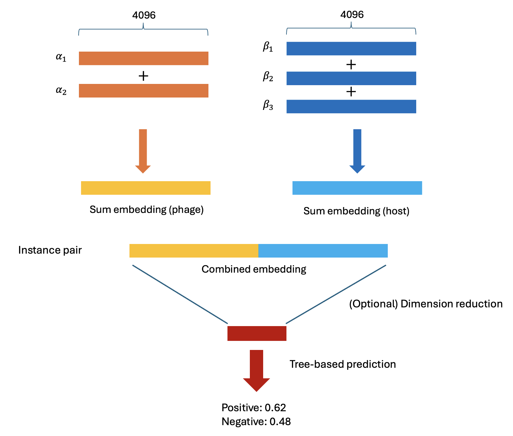

# Tree-based Classifier

## Model architecture

The input sequence to the Transformer is a concatenation of the bacteria and phage embeddings. Since the sequence length varies between different pairs, we first sum the embeddings within each sequence for both bacteria and phage. After this, we concatenate the summed phage embedding with the summed bacterial embedding. This process allows us to construct a tabular-formatted input suitable for tree-based methods. We explore two popular tree-based models: XGBoost for preliminary exploration and LightGBM for large-scale hyperparameter search.

<div style="text-align: center;">
    
</div>


## Data pipeline

The original dataset is a list of matching bacterias and phages, i.e., pairs that are known to have interactions. We first augment this dataset with non-interacting (negative) pairs by iterating over the combinations of bacterias and phages. 

Since the number of negative pairs dominates the number of positive pairs, random sampling from this imbalanced data will lead to a poor performing model. We therefore adopt a sampling weight strategy. Specifically, we assign weight to the positive samples, approximately as the inverse proportion of the positive cases. 

# Usage

To train the model, run:

```
python train.py
--data <DATASET NAME>
--embeddingPath <Embedding_Root_Path> 
--metaPath <MetaData_Root_Path>
